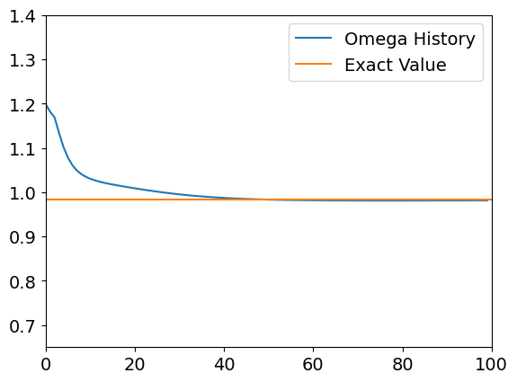

# Q-Balls Solutions Using Deep Learning

This repository contains the code for solving the Klein-Gordon equation to obtain Q-ball solutions using **Physics-Informed Neural Networks (PINNs)** implemented in PyTorch. The project was utilized as part of an oral communication in the Post-Graduation Program in Physics at the Federal University of Pará, Brazil.

## Project Overview

Q-balls are non-topological solitons that appear in scalar field theories with particular types of potentials. The Klein-Gordon equation for a spherically symmetric Q-ball is solved using deep learning techniques, specifically a PINN that fits the eigenvalue problem associated with the field.

### Klein-Gordon Equation
The main equation being solved is:

$$\frac{ d^{2} \phi(r)}{dr^{2}} + \frac{2}{r}\frac{ d \phi(r)}{dr} = \left( \frac{dU}{d|\Phi|^{2}} - \omega^{2} \right)\phi(r)$$

### Scalar Field Ansatz
For a spherically symmetric solution, the Ansatz for the scalar field is:

$$\Phi(r, t) = \phi(r) e^{-i \omega t}$$

### Potential Function
The potential used for the scalar field in this project is:

$$U(|\Phi|) = m^{2} |\Phi|^{2} − \beta |\Phi|^{4} + \lambda |\Phi|^{6}$$

The derivative of the potential with respect to the field is:

$$\frac{dU}{d|\Phi|^{2}} = m^{2} − 4 \beta |\Phi|^{2} + 6 \lambda |\Phi|^{4}$$

## Implementation

This project implements a PINN to solve the eigenvalue problem for the Q-ball solution. A neural network is trained to satisfy the differential equation, the boundary conditions, and the non-negativity of the solution. The network's loss function is defined based on the residual of the Klein-Gordon equation and constraints on the eigenvalue $\omega$.

### Key Features
- **Eigenvalue Search**: The neural network adjusts the eigenvalue $\omega$ via backpropagation to satisfy the boundary conditions and obtain a physically consistent solution.
- **PINN Architecture**: A custom neural network architecture designed to handle both the differential equation and boundary conditions.
- **Error Analysis**: The error between the PINN solution and the numerical solution obtained via the `solve_ivp` function is computed and plotted.

## Code Structure
- **`Best_Q_balls_eq_pytorch.ipynb`**: The main notebook containing all the code for defining the neural network, solving the differential equation, and visualizing the results.
- **Functions**:
  - `solve_qb`: Implements a numerical solver using the `solve_ivp` method to benchmark the results.
  - `ODE` and `ODE2`: Define the neural network architecture.
  - `ODELoss`: Implements the custom loss function based on the Klein-Gordon equation.
  - `gradients`: Utility function for computing gradients of tensors.

## Results

The notebook demonstrates how the neural network can converge to a solution for the scalar field $\phi(r)$ and the eigenvalue $\omega$. It also compares the PINN solution with a traditional numerical solver and visualizes the convergence of $\omega$.

### Visualization
- Loss function decay during training.
- Convergence of $\omega$ over iterations.
- Comparison between the PINN solution and the numerical solution.

## Requirements

The following libraries are required to run the notebook:
- `numpy`
- `torch`
- `matplotlib`
- `scipy`

## Usage

Clone the repository and open the notebook in Colab or Jupyter:

